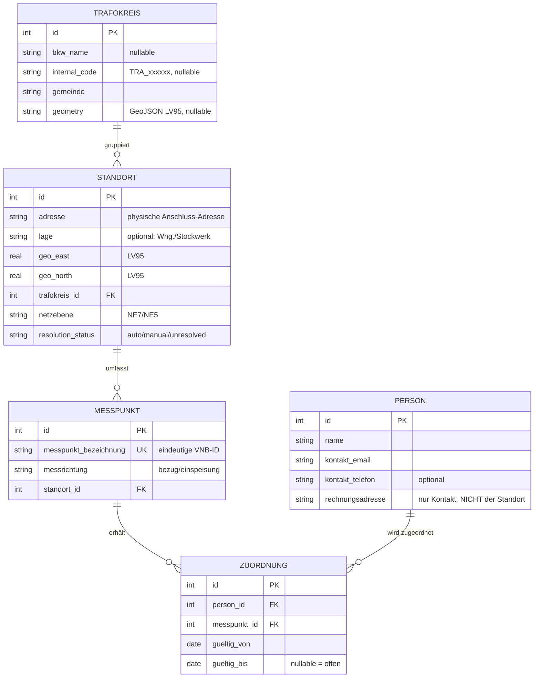

# Claude-Code-Prompt: Datenmodell (4-Objekt) + Ansichten + Suche

*Löst frühere Prompt-Versionen ab. Baut die bestehende LEG-Abrechnungssoftware (Python, NiceGUI, SQLite, lokale Desktop-App, BKW-Netzgebiet) um.*

## Kernprinzip

Der **Trafokreis** ist eine Eigenschaft des **Standorts** (Netzanschluss), nicht der Person. Die Person ist einem **Messpunkt** nur **zeitlich begrenzt** zugeordnet. Zieht eine Person um, endet die Zuordnung zum bisherigen Messpunkt und beginnt eine neue — Standort, Messpunkt und Trafokreis bleiben unverändert. Identität eines Messpunkts = **Messpunktbezeichnung** (VNB-ID), nicht die Adresse.

## Projektkonventionen (zwingend)

- Quellcode/Kommentare **Englisch**, UI-Texte **Deutsch**. Docstrings auf allen Funktionen/Methoden. Keine komplexen Lambdas.
- **pytest**-Tests für Edge Cases. SQLite-Schema-Versionierung mit **nummerierten Migrationen**, rückwärtskompatibel (alte Backups ladbar).
- Externe/unsichere Datenquellen als **isolierte, austauschbare Module**.
- Fremdreferenzen (OpenLEG, AGPL-3.0) nur als Format-Referenz; **kein Code kopieren**.

---

## 1. Datenmodell — 4 Objekte (final)

Kein eigenes Zähler-Objekt. Genau vier Entitäten:

**Regeln:**
- `trafokreis_id` liegt an **STANDORT** — nie an PERSON oder MESSPUNKT. Alle Messpunkte eines Standorts teilen denselben Trafokreis.
- **Rechnungsadresse** ist ein Feld der PERSON und bewusst getrennt von der Standort-Adresse (Rechnung kann anderswohin gehen als der physische Anschluss).
- Person ↔ Messpunkt ausschliesslich über die **datierte** ZUORDNUNG.
- Rolle (Konsument/Produzent/Prosumer) wird **abgeleitet** aus den Messrichtungen der aktuell zugeordneten Messpunkte — kein Rollenfeld.

---

## 2. Migration

**Angepasst (Projektstand):** Es existieren ausser Testdaten keine Live-Daten,
die erhalten werden müssten. Testdaten können jederzeit über den
Demo-Daten-Generator neu angelegt werden. Der Migrationsschritt muss daher
**keine Altdaten mappen oder rückwärtskompatibel überführen** — es genügt
ein sauberer, nummerierter Schema-Neuaufbau:

1. Neue Migration (nächste Versionsnummer) im bestehenden
   Migrationsmechanismus: alte Tabellen `participants`, `meters`,
   `meter_assignments` sowie die davon abhängigen Spalten in
   `readings`/`billing_run_items` **droppen**.
2. Tabellen `standort`, `messpunkt`, `person`, `zuordnung`, `trafokreis`
   gemäss Datenmodell neu anlegen; `readings` und `billing_run_items` auf
   `messpunkt_id` bzw. `person_id` umstellen.
3. Kein Backfill, kein Altdaten-Mapping — die Migration setzt voraus, dass
   die Datenbank anschliessend über „Demo-Daten erzeugen" bzw. manuelle
   Eingabe neu befüllt wird.
4. Der **Migrationsmechanismus selbst** (nummerierte Schritte,
   Schema-Versionierung, Anwendung beim Start/Wiederherstellen) bleibt
   unverändert bestehen und wird weiterhin so eingesetzt — das betrifft nur
   diesen einen Schritt, nicht das Prinzip. Künftige Schemaänderungen sollen
   weiterhin sauber migriert werden, sobald echte Nutzdaten existieren.

---

## 3. Trafokreis-Auflösung — am Standort

Geocoding und Resolver werden beim Anlegen/Bearbeiten eines **STANDORTS** ausgelöst (nicht bei einer Person).

- `address_geocoder.py` (isoliert): Adresse → LV95 über geo.admin.ch
  `https://api3.geo.admin.ch/rest/services/api/SearchServer?searchText=<Adresse>&type=locations&origins=address&sr=2056`
- `trafokreis_resolver.py` (isoliert, austauschbar), Interface `TrafokreisResolver.resolve(east, north) -> int | None`:
  - `GeometryResolver`: Point-in-Polygon gegen `trafokreis.geometry` (bevorzugt, offline).
  - `ManualResolver` (Default): liefert `None` → manuelle Zuweisung.
  - `FeatureServerResolver` (optionaler Stub, klar als undokumentiert/fragil markiert).

Flow: geocoden → cachen → `resolve()`. Treffer → `trafokreis_id` + `resolution_status='auto'`. `None` → `'unresolved'`, UI fordert manuelle Zuweisung (bestehenden Trafokreis wählen oder neuen anlegen). Trafokreise nie stillschweigend erzeugen. Adressänderung → neu auflösen; manuelle Zuweisung erst nach Rückfrage überschreiben.

---

## 4. Trafokreis-Register & Namenslogik

Tabelle `trafokreis` wie oben. BKW-Name im Format `<Gemeinde>_TRA<Nummer>` (z. B. `Gurzelen_TRA12741`) verwenden, wenn bekannt; sonst `internal_code` automatisch als `TRA_xxxxxx` generieren (6-stellig, führende Nullen, fortlaufend, UNIQUE; Hilfsfunktion `generate_internal_trafokreis_code()`). Anzeige-Property `label` = `bkw_name` oder sonst `internal_code`; Fremdschlüssel immer über `id`. NiceGUI-CRUD (deutsche UI), GeoJSON-Import, Anzahl zugeordneter Standorte, Löschen nur ohne zugeordneten Standort.

---

## 5. Messpunkt-Identität & SDAT-CH-Import

- Messpunkt eindeutig über `messpunkt_bezeichnung`. Postadresse ist nie Identitätsschlüssel.
- Isolierter SDAT/EBIX-Parser wird erweitert, um die **Messpunktbezeichnung** aus dem Dokument zu extrahieren. **Es liegt noch keine echte BKW-Beispieldatei vor** — die exakte XPath/Element-Bezeichnung (vermutlich im Dokument-Header bzw. Messpunkt-Abschnitt) muss **vermutet** und später gegen echte Live-Daten **verifiziert/korrigiert** werden. Diese Annahme im Code klar als TODO markieren. Hinweis: Die OpenLEG-Referenz extrahiert die Messpunkt-ID nicht — hier bewusst darüber hinausgehen.
- Import ordnet Zeitreihen über `messpunkt_bezeichnung` dem `messpunkt` zu, ist **idempotent**, und meldet unbekannte Bezeichnungen (kein stilles Anlegen).

---

## 6. Messrichtung & Prosumer

Jeder Messpunkt trägt `messrichtung` (`bezug`/`einspeisung`). Ein Prosumer hat mehrere Messpunkte (mind. Bezug + Einspeisung) am selben Standort. Rolle abgeleitet: nur Bezug → Konsument; nur Einspeisung → Produzent; beides → Prosumer. Bestehende Prosumer-Logik (getrennte Rechnung/Gutschrift) darauf umstellen.

---

## 7. Ansichten (NiceGUI, deutsche UI)

Je Objekt eine Listenansicht und eine Detailansicht.

### Personen-Detailansicht (wichtig)
Zeigt neben den Stammdaten (Name, Kontakt, Rechnungsadresse) eine Tabelle der zugeordneten Messpunkte, geholt über den Join **Person → Zuordnung → Messpunkt → Standort (→ Trafokreis)**. Spalten:
- Messpunktbezeichnung
- Messrichtung
- Standort-Adresse (wo der Messpunkt physisch sitzt)
- Trafokreis (`label`)
- gültig_von, gültig_bis

Standard: nur **aktuell gültige** Zuordnungen (heutiges Datum im Fenster). Umschalter **„alle anzeigen"** blendet die Historie ein.

### Weitere Detailansichten
- Standort: Adresse, Lage, Trafokreis, `resolution_status` + Liste seiner Messpunkte.
- Messpunkt: Bezeichnung, Messrichtung, zugehöriger Standort, aktuell zugeordnete Person.

---

## 8. Suche pro Ansicht

In **jeder Listenansicht** ein Suchfeld. Umsetzung: einfacher, gross-/kleinschreibungsunabhängiger **Teilstring-Filter** (debounced) über die relevanten Spalten — **kein** dedizierter Volltextindex (bei erwarteter Grössenordnung von einigen hundert bis wenigen tausend Datensätzen unnötig; SQLite-Performance ist hier kein Thema). NiceGUI-Tabellenfilter nutzen, wo möglich.

Durchsuchte Felder je Ansicht:
- Personen: Name, Kontakt, Rechnungsadresse, sowie Messpunktbezeichnung und Standort-Adresse der zugeordneten Messpunkte.
- Standorte: Adresse, Lage, Gemeinde, Trafokreis-`label`.
- Messpunkte: Messpunktbezeichnung, Messrichtung, Standort-Adresse, aktuell zugeordnete Person.
- Trafokreise: `label`, Gemeinde.

**Upgrade-Pfad (nur dokumentieren, nicht implementieren):** Sollte die Datenmenge später in die Zehntausende wachsen oder gewichtete Mehrwort-Suche nötig werden, ist SQLite **FTS5** die saubere Erweiterung (Virtual Tables + Sync-Trigger). Als Kommentar/Doku hinterlegen.

---

## 9. LEG-Zuschnitt (Hinweis)

„Ein LEG pro Trafokreis" ist mit diesem Modell trivial prüfbar: Messpunkte einer LEG für 40 % müssen Standorte mit identischem `trafokreis_id` haben. Nur als Konsistenz-Check umsetzen.

---

## 10. Tests (pytest)

- Migration: neue Migration läuft auf einer frischen Datenbank fehlerfrei
  durch (Schema-Version, neue Tabellen vorhanden); Migrationsmechanismus
  selbst (nummerierte Schritte, inkrementelles Nachziehen) bleibt wie
  bisher getestet — **kein** Test für Altdaten-Erhalt nötig, siehe Abschnitt 2.
- Umzug: Zuordnung zu MP-A endet (`gueltig_bis`), neue zu MP-B beginnt; Standort/Messpunkt/Trafokreis unverändert; Q-übergreifende Abrechnung bleibt zuordenbar.
- Mehrfamilienhaus: mehrere Messpunkte gleiche Adresse, Unterscheidung nur über `messpunkt_bezeichnung`.
- Prosumer: Bezug + Einspeisung am selben Standort; Rolle korrekt abgeleitet.
- Trafokreis-Auflösung am Standort: auto / unresolved→manuell / Adressänderung.
- SDAT-Import: Zuordnung über Messpunktbezeichnung; unbekannte Bezeichnung gemeldet; idempotent.
- Personen-Ansicht: Join zeigt korrekte Messpunkte + Standort-Adressen; „nur aktuell" vs. „alle".
- Suche: Teilstring-Filter je Ansicht trifft die definierten Felder (auch die verknüpften bei Personen).
- `internal_code`: Eindeutigkeit, 6-stellige Nullauffüllung, fortlaufend.

---

## 11. Abschluss

Alle Konventionen einhalten. Trafokreis strikt am Standort. Messpunkt-Identität über `messpunkt_bezeichnung`. Person nur über datierte Zuordnung mit Messpunkten verbunden. Geocoding-/Resolver-/SDAT-Module isoliert und austauschbar. SDAT-Messpunkt-Extraktion als zu verifizierende Annahme markieren. Fremdschlüssel immer über interne `id`.
